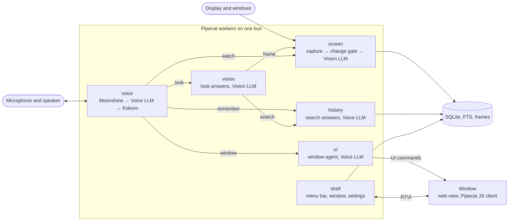
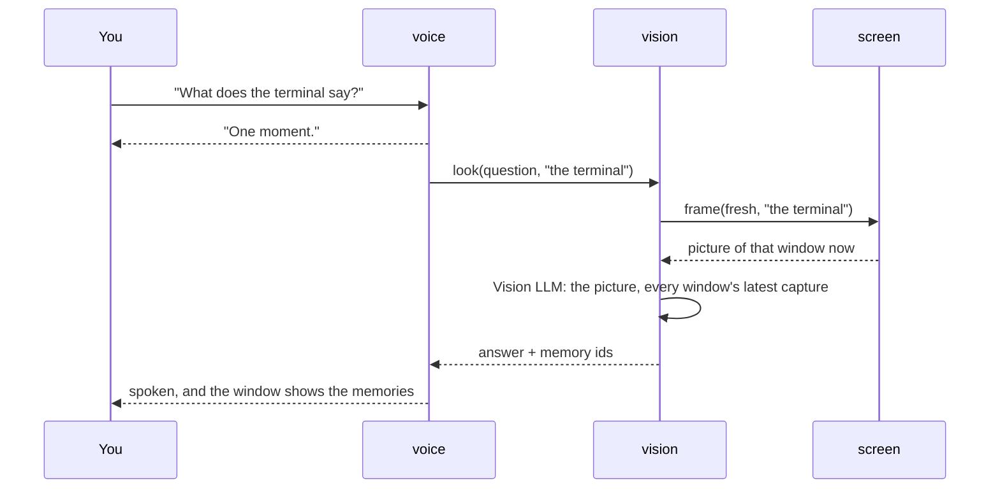
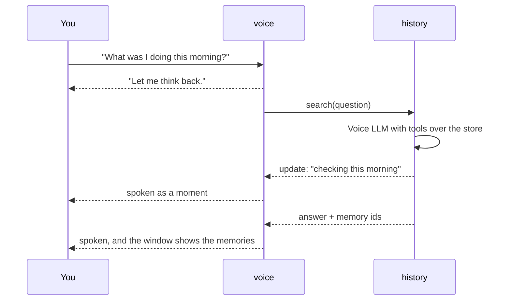
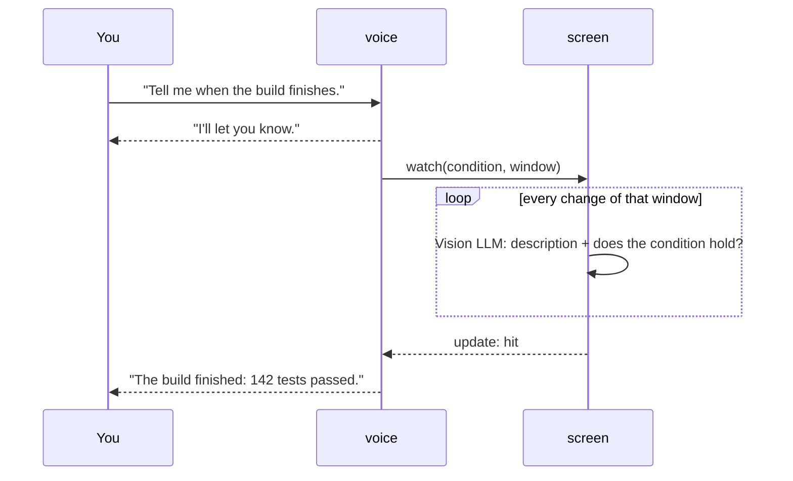

<div align="center">
 
</div>

# Peekaboo

**Peekaboo is an experimental voice assistant for your Mac that remembers
your screen.** It sits in the menu bar, listens for its name, and keeps a
memory of every window you have open. Ask it what you were doing, what a
window says, or to tell you when something happens.

> "Peekaboo, what was I doing this morning?"

## ✨ What it can do

| | What happens | You say |
|---|---|---|
| 🧠 **Remembers your screen** | Every window is captured as it changes and described, with the text that was on it. | "What was I doing this morning?" |
| 🗣️ **Answers from memory** | A short spoken answer, and the screenshots behind it in its window. | "What PR did I look at yesterday?" |
| 👀 **Looks when asked** | Reads a window right now. | "What does the terminal say?" |
| 🔔 **Watches for you** | Binds a condition to a window and speaks up when it happens. | "Tell me when the build finishes." |
| 📅 **Catches meeting reminders** | Reads any app's notification banner and joins with a word. | "Yes, join it." |
| 🖱️ **Runs its window by voice** | Clicks, navigates, and zooms the timeline as if you had. | "Open the third one." |
| 🔒 **Keeps speech local** | Moonshine hears, Kokoro speaks; nothing leaves your Mac until you say its name. | "Peekaboo." |

## 🧠 AI models

Speech stays on your Mac. Only the two language models run in the cloud,
and only the vision one ever sees a screenshot.

| | Runs | Model |
|---|---|---|
| Wake word and speech recognition | On your Mac | Moonshine |
| Voice | On your Mac | Kokoro |
| Conversation (Voice LLM) | Cloud | Anthropic by default, or OpenAI |
| Reading the screen (Vision LLM) | Cloud | Anthropic by default, or OpenAI |

All of it is chosen in Settings ▸ Models. What leaves the Mac: the frames
of windows that changed, sent to the Vision LLM to be described, and your
questions with the memories that answer them, sent to the Voice LLM.
Nothing you say is transcribed in the cloud, and nothing is sent before
you say "Peekaboo".

## ⚙️ How it works

Peekaboo is a showcase of [Pipecat](https://github.com/pipecat-ai/pipecat)
beyond a single voice pipeline, above all of its multi-agent system: six
workers on one runner, talking over one bus. Each owns a pipeline, or a
model, or a piece of the Mac, and hands work to the others as jobs.



**Remembering** never crosses the bus: every two seconds `screen` takes a
still of the display and of each window, a change gate drops what looks the
same as last time, what changed goes to the Vision LLM at most every 15
seconds per window, and the description, the text read off it, and the
frame are written to the store, all inside that one pipeline. What comes out
of it is the memory the others read, and the occasional watcher hit.

**Asking about now** goes to `vision`, which takes a fresh picture.
`voice` acknowledges at once and stays free to listen; the answer arrives
later as a moment, spoken when nobody is talking:



**Asking about the past** skips the picture: `voice` sends the question
straight to `history`, which searches the store with its tools and narrates
as it goes:



**Watching** binds a condition to a window inside `screen`; the hit comes
back over the bus:



**The window** is a web view running the Pipecat JavaScript client. Its
data calls are answered by `shell` over RTVI, and everything the app pushes
is a UI command. "Open the first one" goes from `voice` to `ui`, a Pipecat
`UIWorker` that reads the page's accessibility snapshot and clicks through
the same commands, then speaks its short reply through `voice`'s TTS.

What Pipecat provides here:

- **Workers, a bus, and jobs**: the six workers, their jobs, updates, and results.
- **`LLMWorker` and `UIWorker`**: `voice`, `vision`, and `history` register tools by decorating methods; `ui` acts on the page from its snapshots.
- **A native macOS audio transport** on `AVAudioEngine`, with echo cancellation and microphone selection.
- **Local speech services**: Moonshine as a segmented recognizer, Kokoro as the voice.
- **The JavaScript client and RTVI**: the window is a Pipecat client.
- **Evals**: headless scenarios that check routing, screen questions, watchers, and reminders.

## 📋 Requirements

- macOS 14 or later.
- Python 3.12 and [uv](https://docs.astral.sh/uv/).
- A Pipecat checkout next to this one, at `../pipecat`.
- An Anthropic or OpenAI API key for the two language models. Speech is local and needs none.

## 🚀 Getting started

```bash
uv sync
uv run src/app.py
```

Grant the microphone and Screen Recording when asked, open the window from
the menu bar cat, and paste an Anthropic or OpenAI API key in
Settings ▸ Models. It is stored in your keychain. Then say
"Peekaboo, what's on my screen?"

To run it as an app:

```bash
uv run tools/make_app.py
open dist/Peekaboo.app
```

## 🛠️ Development

```bash
uv run --with pytest pytest tests/            # unit tests
uv run evals/run.py --start-bot evals/*.yaml  # headless scenarios
```

`docs/PLAN.md` is the design and the record of what was tried, measured,
and decided.

## License

BSD 2-Clause, as noted in each source file.
